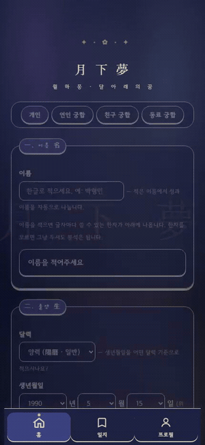
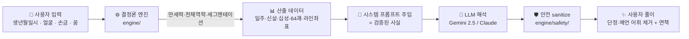
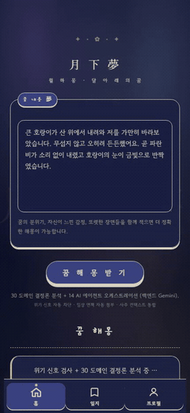
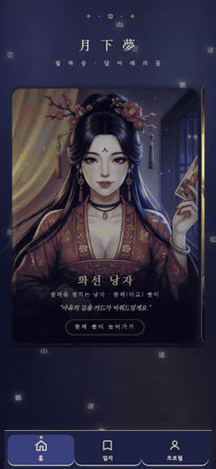
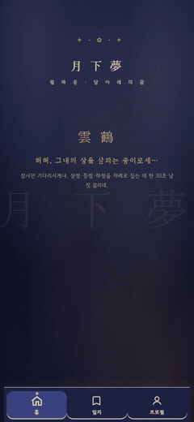
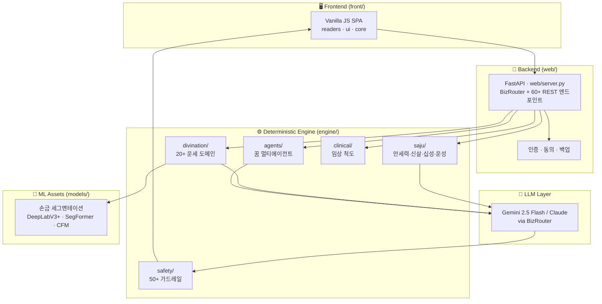

<div align="center">

# 月下夢 · 월하몽

### 사주·MBTI·꿈·관상·손금·임상 스크리닝을 하나로 묶은 인격 융합 운세 대시보드 — *달 아래의 꿈*



</div>

[](https://saju-mbti-fusion.fly.dev/)
[](https://python.org)
[](https://fastapi.tiangolo.com)
[](https://ai.google.dev)
[](https://pytorch.org)
[](https://fly.io)

> **사주·작명·관상·손금·궁합·해몽·화패·점성술·윷점** 등 동서양 운세 전통을, **결정론 엔진이 먼저 계산하고 LLM이 풀어 쓰는** 구조로 통합한 SaaS입니다.
> 만세력·천체역학·신살·64괘는 **코드가 결정론적으로 산출**하고, LLM은 그 결과를 *해석*만 합니다 — 운세의 환각(hallucination)을 원천 차단합니다.

**▶︎ 지금 체험: [saju-mbti-fusion.fly.dev](https://saju-mbti-fusion.fly.dev/)**

---

## How It Works

핵심 철학은 **"계산은 엔진이, 해석은 LLM이"** 입니다. 사주 일주·별자리·28수·신살·64괘 같은 *사실*은 절대 LLM에게 맡기지 않습니다.



> **Important**
> LLM은 **사주·괘·신살을 스스로 만들어내지 않습니다.** 모든 사실값은 `engine/` 결정론 모듈이 계산해 시스템 프롬프트로 주입하고, LLM은 그것을 *경향 어조*로 풀어쓰기만 합니다. (설계 근거: ADR-010 사실성 분리)

---

## 핵심 기능

| | 기능 | 설명 |
|---|---|---|
| 🧮 | **결정론 + LLM 분리** | 만세력·천문계산·세그멘테이션 결과를 엔진이 산출하고, LLM은 *해석만* 담당해 운세 환각을 차단 (ADR-010) |
| 🔮 | **다(多) 도메인 운세** | 사주·작명·관상·손금·궁합·해몽·화패·점성술·윷점·토정비결·12지신·주역·타로 등 동서양 전통을 단일 대시보드로 통합 |
| ✋ | **손금 AI 세그멘테이션** | DeepLabV3+ · SegFormer · CFM(Flow-Matching) **앙상블 SOTA 모델**로 손바닥 손금 라인을 추출 후 풀이 |
| 💭 | **꿈해석 멀티에이전트** | 프로이트·융·라코프(은유 위상)·아르테미도로스 등 정신분석 페르소나 에이전트가 협업해 꿈을 다관점 해석 |
| 🩺 | **임상 스크리닝** | BDI-K·CES-D·ISI·PSQI·STAI-K 등 표준 척도 + IRT 기반 정신건강 자가 점검 (참고용, 진단 아님) |
| 🛡️ | **안전 가드레일** | 의료·법률·금융·결혼·이혼 단정/예언 어휘를 자동 차단(sanitize)하고 모든 출력에 면책 고지 (ADR-006) |
| 🎵 | **멀티모달 결과물** | 사주 기반 웹툰 이미지 생성·운세 음악(MiniMax)·궁합 시청각화 등 결과를 풍부하게 표현 |

<div align="center">

 &nbsp;  &nbsp; 

<sub>왼쪽부터 — 🌙 해몽 멀티에이전트 · 🌸 화패 · 👤 관상</sub>

</div>

---

## Architecture



---

## 운세 도메인

프론트엔드 메인 탭 7종을 포함해, 백엔드 결정론 엔진은 동서양 운세 전통을 폭넓게 다룹니다. 각 도메인은 학술 근거(ADR)에 정합하며 출처 없는 영역은 본문화하지 않습니다.

| 도메인 | 입력 → 출력 | 결정론 근거 |
|---|---|---|
| 🀄 **사주·MBTI** | 생년월일시 → 일주·신살·십성·운성 + MBTI 4축 경향 | 만세력(`lunar-python`) · ADR-014 |
| 💞 **궁합** | 두 사람의 사주 → 합·충·시청각 궁합 | `saju/` + 음악(MiniMax) |
| ✍️ **작명** | 한자 후보 → 어감·획수·음양오행 점수 | ADR-016 한국어 작명 결정론 |
| 👤 **관상** | 얼굴 이미지 → 삼정·5형 기질·인생 흐름 | ADR-178/278 L\*a\*b\* + 전통 기질 매핑 |
| ✋ **손금** | 손바닥 이미지 → 손금 라인 세그멘테이션 → 풀이 | SOTA 앙상블 모델(`models/sota/`) |
| 🌙 **해몽** | 꿈 서사 → 정신분석 멀티에이전트 다관점 해석 | 아르테미도로스 + 프로이트·융 |
| 🌸 **화패** | 화투 패 → 화선 낭자 페르소나 풀이 | `hwapae/` 결정론 |
| ⭐ **점성술** | 출생 천체 위치 → 별자리·하우스 해석 | Skyfield + JPL DE440s 천체역학 (ADR-114) |
| 🎲 **윷점** | 윷 결과 → 64괘 점사 | 한국 정통 윷점 결정론 (ADR-112) |
| 📜 **그 외** | 토정비결 · 12지신 띠운세 · 주역 · 타로 · 부적 · 산통점 · 속궁합 | 각 도메인별 ADR 정합 |

---

## Tech Stack

| 분류 | 기술 | 용도 |
|------|------|------|
| **프론트엔드** | Vanilla JavaScript (SPA) | `readers/`·`ui/`·`core/` 모듈 구조, 탭 기반 대시보드 |
| **백엔드** | FastAPI 0.136 + Uvicorn | 단일 진입점 `web/server.py`(4,500줄), 60+ REST 엔드포인트 |
| **LLM** | Gemini 2.5 Flash / Claude (BizRouter) | 결정론 산출값 해석 — `openai`·`anthropic` SDK 호환 |
| **천문 계산** | Skyfield + JPL DE440s | 점성술 천체역학 결정론 |
| **만세력** | lunar-python | 음력·간지·사주 일주 산출 |
| **ML / 비전** | PyTorch + ONNX | 손금 세그멘테이션(DeepLabV3+·SegFormer·CFM 앙상블) |
| **멀티모달** | MiniMax (Music) | 사주·궁합 기반 음악 생성 |
| **데이터** | SQLite (`/app/data`) | 사용자·일기·임상 로그 |
| **인프라** | Fly.io (Docker, 도쿄 `nrt` 리전) | 한국 사용자 최저 지연 배포 |

---

## Project Structure

```
saju-mbti-fusion/
├── engine/                      # ⚙️ 결정론 코어 (LLM이 건드리지 않음)
│   ├── saju/                    #   만세력·신살·십성·운성 (6,000+ 줄)
│   ├── divination/              #   20+ 운세 도메인
│   │   ├── star/                #     점성술 (Skyfield + DE440s)
│   │   ├── name/                #     작명 (어감·획수·오행)
│   │   ├── face/                #     관상 (삼정·5형 기질)
│   │   ├── palm/                #     손금 (세그멘테이션 풀이)
│   │   ├── hwapae/              #     화패
│   │   ├── dream_lex/           #     해몽 어휘 사전 (아르테미도로스)
│   │   ├── saju_mbti/           #     사주 → MBTI 경향
│   │   ├── yutjeom/             #     윷점 64괘
│   │   └── tojeong, zodiac_ko, talisman, santong, sok_gunghap …
│   ├── agents/                  #   꿈해석 멀티에이전트 (프로이트·융·라코프)
│   ├── clinical/                #   임상 척도 (BDI-K·CES-D·ISI·PSQI·STAI-K·IRT)
│   ├── safety/                  #   50+ 안전 가드레일 (sanitize)
│   ├── llm_async.py / llm_sync.py  # LLM 호출 래퍼
│   └── core.py
├── web/
│   └── server.py                # 🚀 FastAPI 앱 + BizRouter
├── front/                       # 🖥️ Vanilla JS SPA
│   ├── index.html
│   └── js/ (core · data · readers · ui)
├── models/                      # 🧠 손금 세그멘테이션 가중치
│   └── sota/ (deeplabv3plus · segformer · cfm)
├── data/                        # 만세력·KASI 캐시
├── tests/
│   ├── regression/              # 결정론 회귀 (121 파일, 700+ PASS)
│   └── smoke/                   # 스모크 테스트
├── vault/                       # Obsidian Sync — ADR 의사결정 기록 (git 무시)
├── Dockerfile
└── fly.toml
```

---

## Setup

```bash
# 1. 클론
git clone https://github.com/Technoetic/saju-mbti-fusion.git
cd saju-mbti-fusion

# 2. 의존성 설치
pip install -r requirements.txt

# 3. 환경 변수 설정
cp .env.example .env
#   .env 를 열어 BIZROUTER_API_KEY 등을 채웁니다

# 4. 로컬 서버 실행
uvicorn web.server:app --reload --port 8000
#   → http://localhost:8000

# 5. 테스트 (선택)
pytest tests/regression/ -q   # 결정론 회귀 700+ PASS
pytest tests/smoke/ -q        # 스모크
```

### 환경 변수

| Env | Required | Description |
|-----|:---:|-------------|
| `BIZROUTER_API_KEY` | ✓ | LLM 라우터 API 키 (Gemini/Claude 호출) |
| `BIZROUTER_BASE_URL` | ✓ | BizRouter 엔드포인트 (`https://api.bizrouter.ai/v1`) |
| `BIZROUTER_MODEL` | ✓ | 텍스트 모델 (`google/gemini-2.5-flash-lite`) |
| `BIZROUTER_IMAGE_MODEL` |  | 이미지 모델 (`google/gemini-2.5-flash-image`) |
| `MINIMAX_API_KEY` |  | 운세 음악 생성 키 |
| `MINIMAX_MUSIC_MODEL` |  | 음악 모델 (`music-2.6-free`) |
| `DREAM_APP_DB_PATH` |  | 로컬 SQLite 경로 (기본 `./.data/app.db`) |

> **Important**
> `BIZROUTER_*` 키가 없으면 LLM 풀이 기능이 동작하지 않습니다. 단, **결정론 엔진(사주·천문·세그멘테이션) 자체는 키 없이도 산출**됩니다.

---

## API Overview

`web/server.py` 가 60+ REST 엔드포인트를 제공합니다. 핵심 일부:

| Endpoint | Method | 설명 |
|---|:---:|---|
| `/api/health` | GET | 헬스체크 |
| `/api/saju/fusion` | POST | 사주·MBTI 융합 풀이 |
| `/api/saju/compat` | POST | 사주 궁합 (+ `/compat/music` 음악) |
| `/api/star/reading` | POST | 점성술 풀이 (천체역학 기반) |
| `/api/name/reading` | POST | 작명 풀이 |
| `/api/face/reading` | POST | 관상 풀이 |
| `/api/palm/reading` | POST | 손금 세그멘테이션 + 풀이 |
| `/api/dream/interpret_v2` | POST | 꿈해석 멀티에이전트 |
| `/api/hwapae/reading` | POST | 화패 풀이 |
| `/api/iching/divine` | POST | 주역 점 |
| `/api/clinical/screening` | POST | 임상 자가 스크리닝 |

---

## 설계 철학 · 안전성

이 시스템은 운세를 다루지만, **사실과 해석을 엄격히 분리**하고 **단정·예언을 거절**하도록 설계되었습니다. 모든 의사결정은 불변(immutable) ADR 문서로 기록됩니다.

- **ADR-010 — 사실성 분리** : 일주·신살·괘 등 *사실*은 결정론 엔진이 산출, LLM은 *해석*만 담당
- **ADR-006 — 자문 거절** : 의료·법률·금융·결혼·이혼·정신질환의 인과 예언을 코드 차원에서 차단
- **ADR-002 / 015 — 학파 회피** : 특정 사주 학파 단정 대신 옵션 병행
- **ADR-014 — MBTI 단정 회피** : 사주→MBTI는 *경향성*으로만 표현

> **Caution**
> 본 서비스의 모든 결과는 **참고용**이며, 의료·법률·금융 의사결정의 단독 근거가 될 수 없습니다. 임상 스크리닝은 진단이 아니라 자가 점검 도구입니다.

---

## License

별도 라이선스 명시 전까지 모든 권리는 저작권자에게 있습니다. (All rights reserved)

---

<div align="center">

### ✦ 月下夢 · 월하몽 ✦

*달 아래의 꿈 — 계산은 엔진이, 해석은 LLM이.*
*동서양 운세 전통을 하나의 달빛 아래에 모으다.*

<br/>

🀄 사주 · 💞 궁합 · ✍️ 작명 · 👤 관상 · ✋ 손금 · 🌙 해몽 · 🌸 화패 · ⭐ 점성술 · 🎲 윷점

<br/>

[](https://saju-mbti-fusion.fly.dev/)
[](https://saju-mbti-fusion.fly.dev/)

<sub>참고용 서비스입니다 · 의료·법률·금융 의사결정의 단독 근거가 될 수 없습니다</sub>

</div>

<div align="center">
<sub>© 月下夢 — All rights reserved</sub>
</div>
